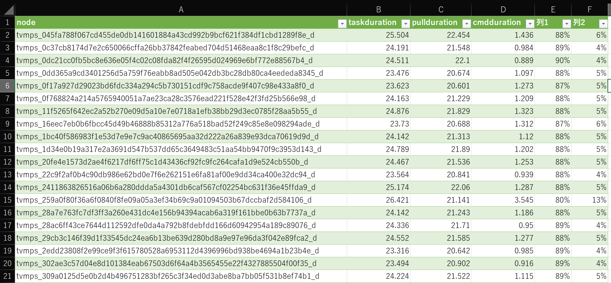

# Parse script for Azure batch agent log

Login as the account which has enough privilege to access Batch and Storage.

```powershell
PS > Connect-AzAccount -Identity
```

Specify the environment.

```powershell
PS > $batacount = 'your-batch-accout-name'
PS > $poolid = 'your-batch-pool-unique-id'
```

Collect and download agent logs.

```powershell
PS > .\scripts\Collect-AgentLogs.ps1 -bachtaccount $batacount -poolid $poolid
```

Sample of data;

```powershell
PS >  $data[0].node   

tvmps_045fa788f067cd455de0db141601884a43cd992b9bcf621f384df1cbd1289f8e_d


PS > $data[0].history | select timestamp, eventname

timestamp                  eventname
---------                  ---------
9/2/2021 8:17:15 AM +00:00 InstanceMetadata
9/2/2021 8:19:24 AM +00:00 TaskStateActive
9/2/2021 8:19:24 AM +00:00 PullImageStart
9/2/2021 8:19:47 AM +00:00 PullImageEnd
9/2/2021 8:19:48 AM +00:00 CommandStart
9/2/2021 8:19:49 AM +00:00 CommandExit
9/2/2021 8:19:49 AM +00:00 TaskStateCompleted
```

Then parse data from dowdnloaded logs.

```powershell
.\scripts\Filter-AgentDebugLog.ps1 -root . | sv data
```

Convert data format for analisys tool like excel.

```powershell
$data | foreach {
    $temp = @{ 
        taskstart = ($_.history | where { $_.eventname -eq "TaskStateActive"})[0].timestamp;
        taskend = ($_.history | where { $_.eventname -eq "TaskStateCompleted"})[0].timestamp;
        pullstart = ($_.history | where { $_.eventname -eq "PullImageStart"})[0].timestamp;
        pullend = ($_.history | where { $_.eventname -eq "PullImageEnd"})[0].timestamp;
        cmdstart = ($_.history | where { $_.eventname -eq "CommandStart"})[0].timestamp;
        cmdend = ($_.history | where { $_.eventname -eq "CommandExit"})[0].timestamp;
    }
    [pscustomobject]@{
        node = $_.node;
        taskduration = ($temp.taskend - $temp.taskstart).TotalSeconds;
        pullduration = ($temp.pullend - $temp.pullstart).TotalSeconds;
        cmdduration = ($temp.cmdend - $temp.cmdstart).TotalSeconds;
    }
} `
| ConvertTo-Csv `
| Add-Content -Path 'output.csv' -Encoding utf8

```

